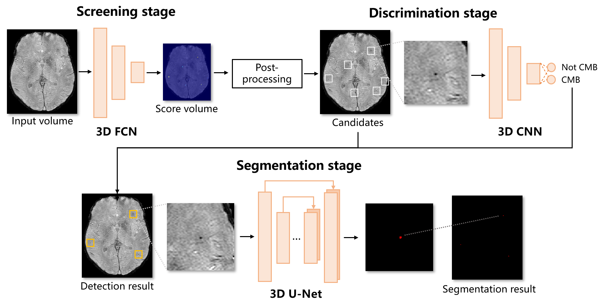

# CMB-Segmentation


## Setup
* Clone this repository
```
git clone https://github.com/zihaochen0319/CMB-Segmentation
cd CMB-Segmentation
```
* Check dependencies in requirements.txt
```
pip install -r requirements.txt
```

## Data Preparation
* Access the data from [VALDO 2021](https://valdo.grand-challenge.org/Description/) and save it in ```./data/Task2/```.
* Proprocess the raw data, run ```python ./data_preprocess_v2.py```. The processed data would be saved in ```./data/Task2_processed/Preprocessed_v2/```.
* (Optional) Run ```python ./data_augmentation.py``` to augment data and set ```aug_num``` in configuration of ```train_xxx.py``` to a non-zero value. Then the augmentation data would be used for training.
* The division of training and validation data can be modified in ```./fold_division.py```.

## Train
This framework consists of three stages: screening, discrimination and segmentation. Each stage should be trained independently
